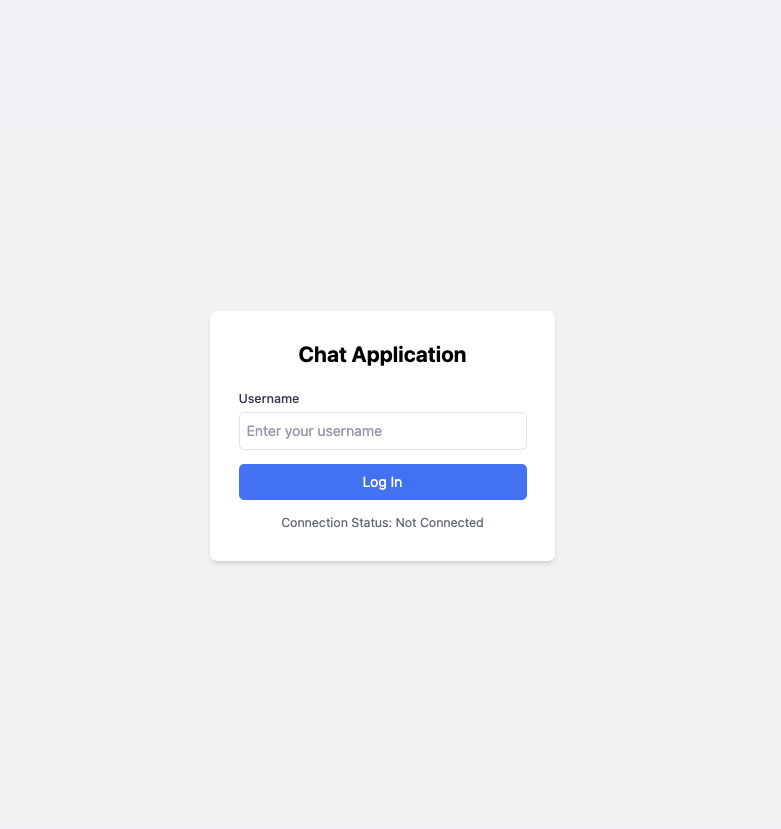
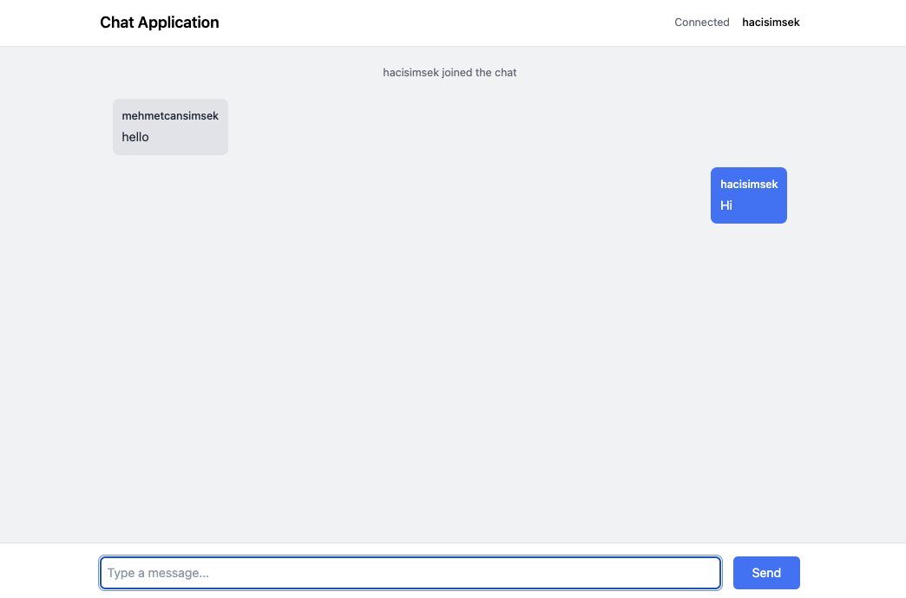
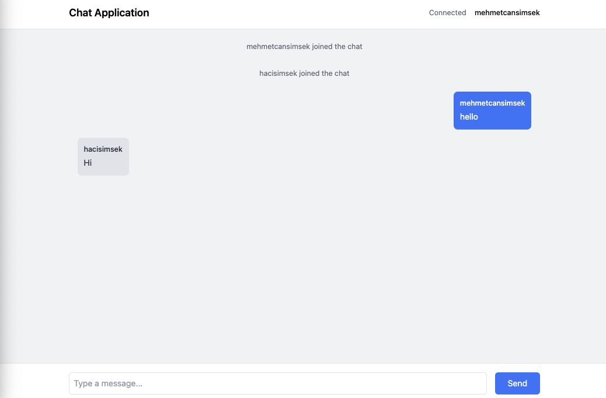

# Real Time Chat Application

A scalable chat system using Java WebSockets and React for the frontend.

## Run The Spring Boot Project

```bash
  mvn spring-boot:run
```
## Run Task Management UI

```bash
  npm start
```

## The Screenshot of Task Management UI 







